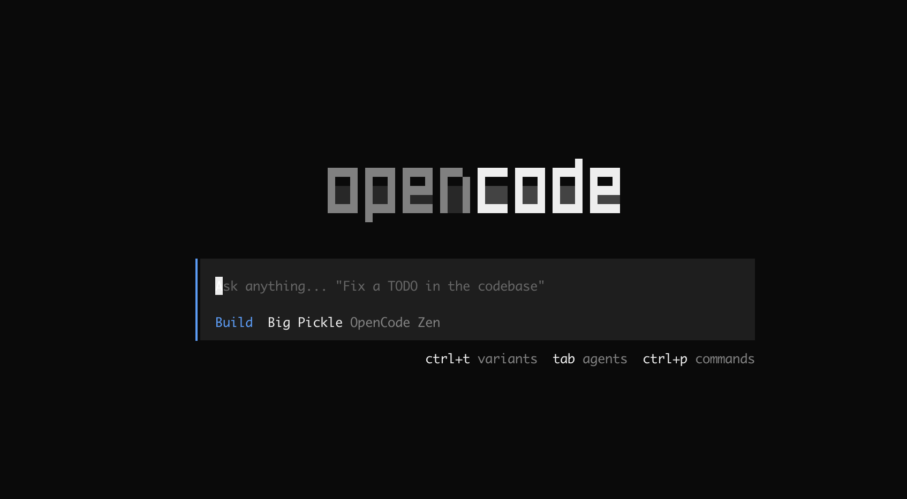
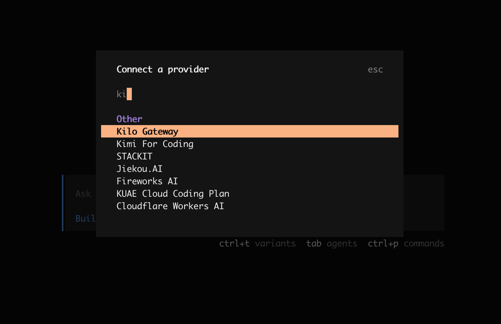
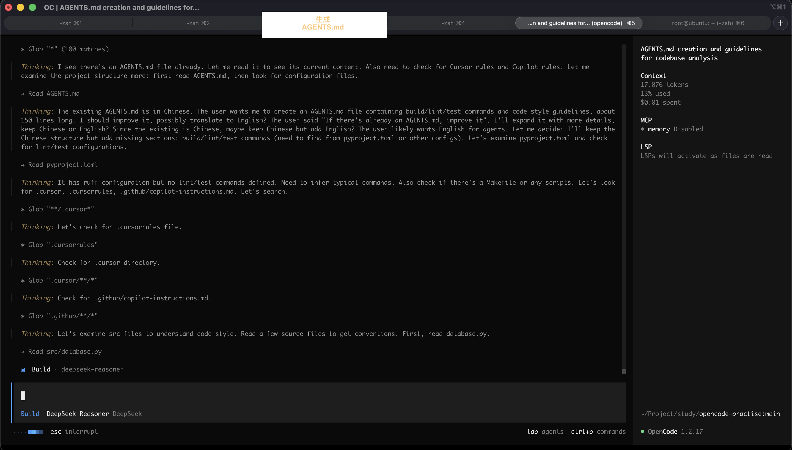
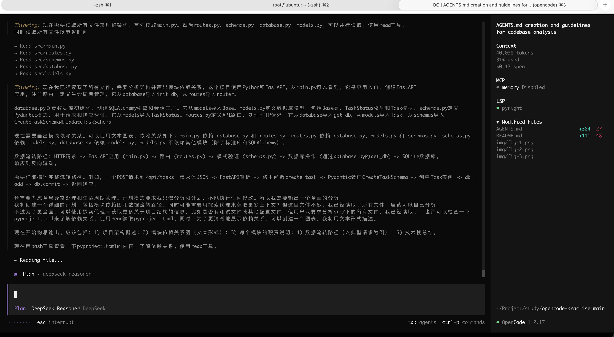
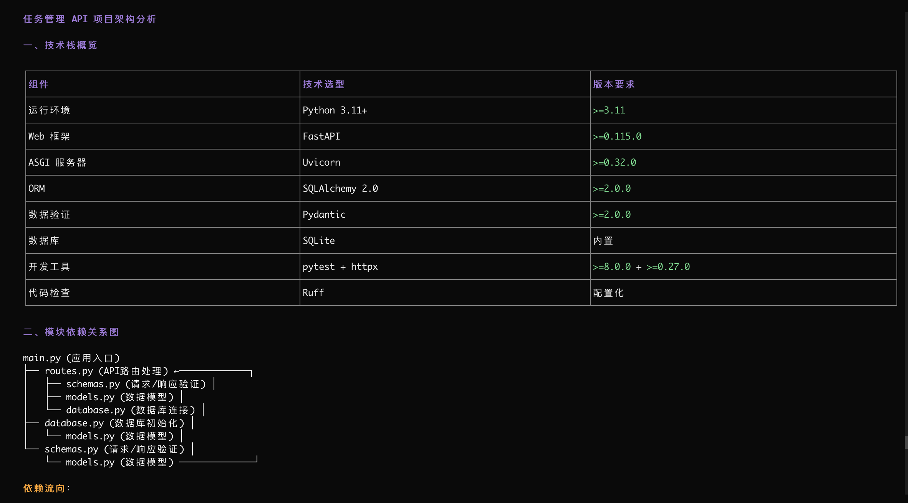
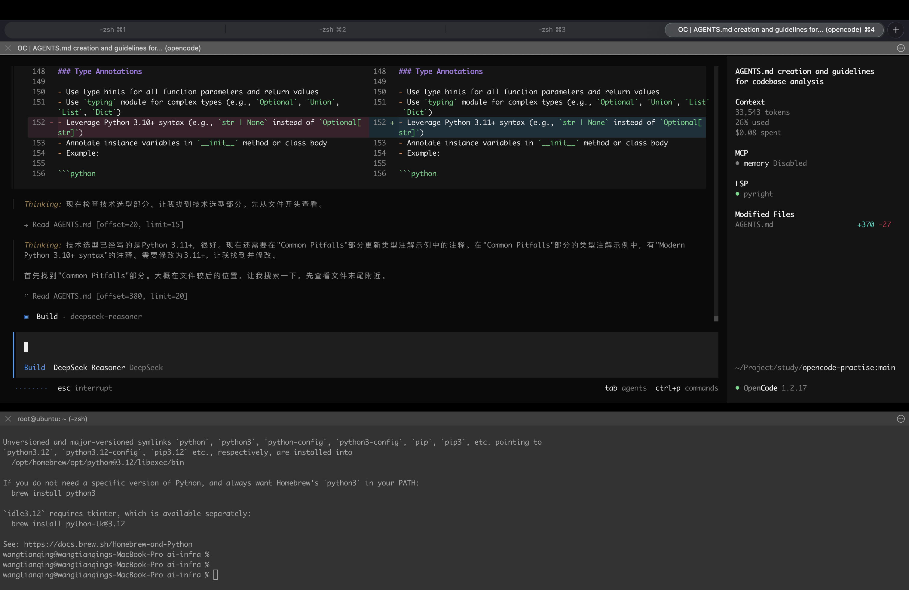
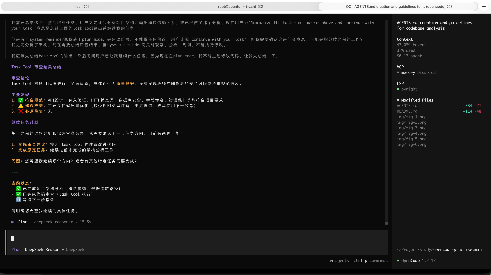

# OpenCode 实战指南：从零用 AI 构建任务管理 API

> 本指南配合《OpenCode 深度解析》文章使用，通过一个完整的实战案例，手把手演示 OpenCode 的核心功能。
> 你将使用 OpenCode 的 Plan 模式、Build 模式、@general 子 Agent、自定义 Skill 等功能，完成一个任务管理 REST API 的开发。

---

## 目录

- [前置准备](#前置准备)
- [第一步：启动 OpenCode 并初始化项目](#第一步启动-opencode-并初始化项目)
- [第二步：用 Plan 模式探索项目结构](#第二步用-plan-模式探索项目结构)
- [第三步：用 Build 模式实现核心功能](#第三步用-build-模式实现核心功能)
- [第四步：使用 @general 进行批量重构](#第四步使用-general-进行批量重构)
- [第五步：使用自定义 Skill 进行代码审查](#第五步使用自定义-skill-进行代码审查)
- [第六步：验证与测试](#第六步验证与测试)
- [进阶：配置 MCP 与记忆系统](#进阶配置-mcp-与记忆系统)
- [项目文件速查](#项目文件速查)

---

## 前置准备

本节用于完成运行环境准备，避免在实战过程中因工具缺失导致中断。完成以下准备后，再进入第一步启动并配置 OpenCode。

### 1. 安装 OpenCode

选择任一方式安装（详见《深度解析》第 5 章）：

```bash
# macOS 推荐
brew install anomalyco/tap/opencode

# 跨平台
npm i -g opencode-ai@latest

# 或一键安装
curl -fsSL https://opencode.ai/install | bash
```

### 2. 安装 Python（本项目的运行时）

本项目使用 Python 3.11+，macOS 通常已预装。检查版本：

```bash
python3 --version
```

如需安装或升级：

```bash
# macOS
brew install python@3.11

# 或使用 pyenv
brew install pyenv
pyenv install 3.11
```

### 3. 创建虚拟环境并安装依赖

在项目根目录执行以下命令：

```bash
python3 -m venv venv
source venv/bin/activate
pip install -e .
```

---

## 第一步：启动 OpenCode 并初始化项目

### 1.1 进入项目目录并启动

```bash
cd opencode-practise
opencode
```


图一：OpenCode TUI 启动界面

启动后你会看到 OpenCode 的 TUI（终端界面）。界面右下角显示当前模式（默认为 **BUILD**）。

如果是首次使用，需要先配置模型提供商。在 TUI 中运行以下命令：

```bash
/connect
```


图二：OpenCode 连接模型提供商界面

选择你的 Provider 并粘贴 API Key。新用户推荐使用 [OpenCode Zen](https://opencode.ai/zen)，提供开箱即用的精选模型。

### 1.2 了解项目已有的配置文件

本项目已经预配置了三个 OpenCode 关键文件，它们的作用如下：

| 文件                                   | 作用                                           | 对应文章章节 |
| :------------------------------------- | :--------------------------------------------- | :----------- |
| `AGENTS.md`                            | 项目"说明书"，告诉 AI 项目架构和编码规范       | 4.1          |
| `opencode.json`                        | OpenCode 配置，含 Skill 路径和 MCP Server 配置 | 2.3          |
| `.opencode/skills/reviewer/SKILL.md`   | 自定义代码审查 Skill                           | 2.1          |
| `.opencode/skills/api-design/SKILL.md` | 自定义 API 设计 Skill                          | 2.1          |

> **关键概念**：OpenCode 在每次 Session 开始时会自动读取 `AGENTS.md`，相当于给 AI 注入了项目的"潜意识"（见文章 4.1 节）。这就是为什么我们要先准备好这个文件。

### 1.3 查看 AGENTS.md 的结构

我们也可以让 OpenCode 自动生成 `AGENTS.md`：

```bash
/init
```


图三：OpenCode 自动生成 AGENTS.md 界面

但本项目已预先编写好，包含以下关键部分：

- **项目概览**：Python + FastAPI + SQLAlchemy + SQLite
- **架构描述**：`src/` 目录中每个文件的职责
- **编码规范**：snake_case 命名、Early Return、类型注解（来自文章 4.2 节）
- **API 设计约定**：RESTful、统一 JSON 格式、Pydantic 校验
- **数据库规范**：snake_case 字段名（来自文章 4.3 节）

### 1.4 确认当前项目状态

为了模拟真实的开发场景，当前代码库仅包含**基础的任务管理功能**（CRUD）。

- **已实现**：任务的增删改查接口（`src/routes.py`）、基础数据模型（`src/models.py`）。
- **待实现（实战目标）**：
  1. **标签系统**：Tag 模型及关联表。
  2. **统计接口**：按状态统计任务数量。
  3. **高级查询**：按标签筛选任务。

接下来的章节，我们将使用 OpenCode 的 **Plan 模式** 和 **Build 模式** 来一步步实现这些缺失的功能。

---

## 第二步：用 Plan 模式探索项目结构

> **对应文章**：1.2 节（Plan Agent）、6.2 节（场景一：探索陌生代码库）

### 2.1 切换到 Plan 模式

按 `Tab` 键，界面右下角切换为 **PLAN**。

> **Plan 模式的核心特性**（见文章 1.2 节）：
>
> - `edit` 权限被 `deny`——**不会修改你的任何代码**（仅允许写入 `.opencode/plans/*.md`）
> - `bash` 命令需要用户确认（`ask`）
> - 内部会调度 **Explore 子 Agent** 并行探索代码库

### 2.2 让 AI 分析项目

在输入框中输入：

```bash
分析这个任务管理 API 项目的整体架构。
阅读 src/ 下的所有文件，画出模块依赖关系，并说明数据从 HTTP 请求到数据库的完整流转路径。
```


图3：Plan 模式下的分析过程

**预期行为**：

1. Plan Agent 收到指令后，会内部调度 **Explore 子 Agent**（最多 3 个并行实例）搜索代码库。
2. 你会看到 Agent 逐个读取 `src/main.py`、`src/routes.py`、`src/database.py`、`src/models.py`、`src/schemas.py`。
3. 最终输出一份结构化的分析报告，可能包含：

```text
请求流转路径:

  Client Request
       ↓
  src/main.py       (FastAPI 入口，注册中间件和生命周期)
       ↓
  src/routes.py     (路由分发，Pydantic 校验请求体)
       ↓
  src/database.py   (SQLAlchemy 会话管理)
       ↓
  src/models.py     (表结构定义)
```


图5：Plan 模式下的架构分析典型输出

> **重点体验**：整个探索过程中，Plan Agent **不会修改任何文件**。你可以放心让它随意探索。

### 2.3 让 AI 制定扩展方案

继续在 Plan 模式中输入：

```text
我想给这个 API 新增以下功能：
1. 任务标签系统（一个任务可以有多个标签）
2. 按标签筛选任务
3. 任务统计接口（各状态的数量）

请制定一个详细的实施方案，包括需要修改哪些文件、新增哪些文件、数据库模型变更。
```

**预期行为**：

Plan Agent 会输出一份结构化的实施方案（可能自动保存到 `.opencode/plans/` 目录），包括：

- 新增 `Tag` 模型和 `task_tags` 关联表
- `routes.py` 中需要新增的端点
- `schemas.py` 中需要新增的 Pydantic Schema
- 预估的代码修改范围

> **这就是 Plan 模式的价值**：先探索、先规划，再动手。避免 AI 在不了解项目的情况下直接修改代码。

---

## 第三步：用 Build 模式实现核心功能

> **对应文章**：1.2 节（Build Agent）、6.3 节（场景二：开发新功能）

### 3.1 切换到 Build 模式

按 `Tab` 键切回 **BUILD** 模式。

### 3.2 实现标签系统

基于 Plan 模式给出的方案，输入：

```text
根据之前的规划，实现任务标签系统。具体要求：
1. 在 src/models.py 中新增 Tag 模型和 task_tags 关联表
2. 在 src/schemas.py 中新增 TagSchema
3. 在 src/routes.py 中新增以下端点：
   - POST /api/tasks/:id/tags — 给任务添加标签
   - DELETE /api/tasks/:id/tags/:tag — 删除任务的标签
   - GET /api/tasks?tag=xxx — 按标签筛选任务
```


图6：Build 模式下的代码修改 Diff

**预期行为**：

Build Agent 会依次：

1. 修改 `src/models.py`——添加 `Tag` 模型和关联表
2. 修改 `src/schemas.py`——添加标签相关的 Pydantic Schema
3. 修改 `src/routes.py`——添加标签相关路由
4. 每一步修改都可以在终端中实时看到 diff

> **关键交互**：如果 AI 需要执行 Shell 命令（如运行测试），它会弹出权限确认，你可以选择：
>
> - **Once**（允许这一次）
> - **Always**（永远允许这类操作）
> - **Reject**（拒绝）

### 3.3 实现统计接口

```text
在 src/routes.py 中添加 GET /api/tasks/stats 端点，返回各状态的任务数量。
响应格式：{ "data": { "todo": 5, "doing": 3, "done": 12, "total": 20 } }
```

### 3.4 使用 /undo 撤销

如果对某次修改不满意：

```bash
/undo
```

OpenCode 会瞬间撤销上一轮的所有文件变更。这是一个非常安全的操作。

### 3.5 使用 API 设计 Skill

本项目在 `.opencode/skills/api-design/` 中预置了 API 设计 Skill。当需要设计新端点时：

```bash
使用 api-design skill，帮我设计一个批量创建任务的 API 端点。
```

**预期行为**：

Agent 会按照 Skill 中定义的规范，输出完整的路由定义、请求参数、响应格式和实现代码。

---

## 第四步：使用 @general 进行批量重构

> **对应文章**：1.2 节（General Subagent）、6.4 节（场景三）

### 4.1 批量添加输入校验

在 Build 模式下，输入：

```text
@general 请检查 src/routes.py 中所有路由处理函数：
1. 确保所有接收请求体的端点都使用了 Pydantic 校验
2. 确保所有返回错误的地方使用了统一的 { "error": "..." } 格式
3. 确保所有 ID 参数都做了类型检查
列出所有发现的问题，并给出修复方案。
```

**预期行为**：

`@general` 子 Agent 会并行执行多个搜索单元（见文章 1.2 节），全面扫描路由文件，然后给出一个结构化的检查报告。

### 4.2 批量添加错误处理

```text
@general 为项目添加全局错误处理：
1. 在 src/main.py 中添加 FastAPI 的 exception_handler
2. 捕获未处理的异常，返回 500 + 统一错误格式
3. 在开发模式下输出错误堆栈，生产模式下隐藏细节
```

---

## 第五步：使用自定义 Skill 进行代码审查

> **对应文章**：2.1 节（Agent Skills）

### 5.1 触发代码审查 Skill

本项目在 `.opencode/skills/reviewer/` 中预置了一个代码审查 Skill。在 Build 模式下输入：

```bash
使用 reviewer skill 对当前项目进行全面的代码审查。
```

**预期行为**：

Agent 会加载 `SKILL.md` 中定义的审查清单，按照以下维度逐项检查：

1. **编码规范**：变量命名是否使用 snake_case、是否使用 Early Return
2. **API 设计**：路由是否 RESTful、响应格式是否统一
3. **数据库**：字段是否 snake_case、是否有 SQL 注入风险
4. **安全**：是否有输入校验、敏感信息是否泄露
5. **性能**：是否有冗余查询

最终输出格式（由 Skill 定义）：

```text
## 审查结果

### ✅ 通过项
- 所有变量名符合 snake_case 命名规范
- 使用了 Pydantic 校验请求体
- ...

### ⚠️ 建议改进
- routes.py 第 xx 行：可以使用三元表达式替代 if/else
- ...

### ❌ 必须修复
- ...
```

### 5.2 实际审查结果示例


图7：Reviewer Skill 的输出报告

_展示代码审查 Skill 运行后的 Markdown 格式报告，清晰展示 ✅ 通过项、⚠️ 建议改进和 ❌ 必须修复三类结果。_

以下是运行 `reviewer` Skill 对本项目进行代码审查后得到的实际结果：

```text
## 审查结果

### ✅ 通过项
- API设计规范：路由使用RESTful风格（/api/tasks），响应使用统一JSON格式（{"data": ...}/{"error": "..."}）
- 输入验证：使用Pydantic进行请求体校验（相当于Python的Zod）
- HTTP状态码：正确使用201（创建成功）、200（成功）、404（未找到）
- 数据库安全：使用SQLAlchemy ORM，避免SQL注入风险
- 字段命名：数据库模型字段使用snake_case（如created_at、updated_at）
- 错误信息保护：生产环境隐藏详细错误信息（src/main.py:48）
- 代码简洁：合理使用列表推导式（src/routes.py:18），函数长度适中
- 类型注解：主要函数和类都有类型提示

### ⚠️ 建议改进
- 返回类型注解缺失：src/routes.py 的部分函数缺少返回类型注解
- 导入优化：src/routes.py 可改为 from datetime import datetime 并直接使用
- 全局异常处理过宽：src/main.py 捕获所有 Exception，建议捕获特定异常类型
- 数据库查询重复：多个路由中有相同的查询模式，可抽取为辅助函数
- 分页缺失：list_tasks 函数获取所有任务，数据量大时可能有性能问题
- 枚举使用不一致：TaskStatus 的使用方式可以统一

### ❌ 必须修复
- 无 - 当前代码没有发现必须立即修复的安全风险或严重规范违反

总结：代码整体质量良好，遵循了项目规范，主要需要补充类型注解和优化部分重复代码。
```

> **注意**：以上审查结果仅供参考，实际使用时可根据 Skill 配置和项目需求调整审查标准。

---

## 第六步：验证与测试

### 6.1 启动服务

```bash
# 确保激活虚拟环境
source venv/bin/activate

# 开发模式运行
uvicorn src.main:app --reload --port 3000
```

服务启动后，访问 `http://localhost:3000` 应返回：

```json
{ "message": "Task Manager API is running" }
```

### 6.2 使用 curl 测试 API

**创建任务**：

```bash
curl -X POST http://localhost:3000/api/tasks \
  -H "Content-Type: application/json" \
  -d '{"title": "学习 OpenCode", "priority": 2}'
```

预期响应（201）：

```json
{
  "data": {
    "id": 1,
    "title": "学习 OpenCode",
    "description": "",
    "status": "todo",
    "priority": 2,
    "created_at": 1735689600000,
    "updated_at": 1735689600000
  }
}
```

**查询所有任务**：

```bash
curl http://localhost:3000/api/tasks
```

**更新任务状态**：

```bash
curl -X PATCH http://localhost:3000/api/tasks/1 \
  -H "Content-Type: application/json" \
  -d '{"status": "done"}'
```

**删除任务**：

```bash
curl -X DELETE http://localhost:3000/api/tasks/1
```

### 6.3 让 OpenCode 帮你写测试

回到 OpenCode，在 Build 模式下输入：

```bash
为 src/routes.py 中的所有端点编写测试。使用 pytest 和 httpx。
测试文件放在 tests/test_routes.py。
要求：测试真实的 HTTP 请求和数据库操作，不使用 mock。
```

---

## 进阶：配置 MCP 与记忆系统

> **对应文章**：2.3 节（MCP 集成）、2.5 节（持久记忆系统）

### 配置 Mem0 实现跨 Session 记忆

本项目的 `opencode.json` 已预配置了 Mem0 MCP Server（默认关闭）。启用方法：

1. 安装并启动 Mem0 OpenMemory（参考 [mem0.ai](https://mem0.ai)）
2. 获取 API Key
3. 编辑 `opencode.json`，将 `"enabled": false` 改为 `true`，并填入你的 API Key
4. 重启 OpenCode

启用后，你可以在会话中输入：

```bash
记住这个项目的数据库使用 SQLite，模型字段用 snake_case
```

下次新建 Session 时，AI 将自动"记忆"这些信息。

### 配置其他 MCP Server

你可以在 `opencode.json` 的 `mcp` 字段中添加任意 MCP Server，例如：

```json
{
  "mcp": {
    "github": {
      "type": "local",
      "command": ["npx", "-y", "@modelcontextprotocol/server-github"],
      "enabled": true,
      "environment": {
        "GITHUB_PERSONAL_ACCESS_TOKEN": "ghp_xxxxx"
      }
    }
  }
}
```

这样 OpenCode 就能直接访问 GitHub Issue、PR 等信息，无需手动复制粘贴。

---

## 项目文件速查

```text
opencode-practise/
├── AGENTS.md                            ← 项目"说明书"（文章 4.1 节）
├── opencode.json                        ← OpenCode 配置（文章 2.3 节）
├── opencode_deep_dive.md                ← OpenCode 深度解析文章
├── pyproject.toml                       ← Python 项目配置
├── .gitignore                           ← Git 忽略规则
├── tasks.db                             ← SQLite 数据库（运行后生成）
├── .opencode/
│   └── skills/
│       ├── reviewer/
│       │   └── SKILL.md                 ← 代码审查 Skill（文章 2.1 节）
│       └── api-design/
│           └── SKILL.md                 ← API 设计 Skill（文章 2.1 节）
├── tests/                               ← 测试目录（按需创建）
└── src/
    ├── __init__.py                      ← Python 包初始化
    ├── main.py                          ← 服务器入口（FastAPI + 中间件）
    ├── database.py                      ← 数据库初始化（SQLAlchemy + SQLite）
    ├── models.py                        ← 数据库模型定义（snake_case 字段）
    ├── schemas.py                       ← Pydantic Schema（请求/响应验证）
    └── routes.py                        ← CRUD 路由（Pydantic 校验）
```

### 功能与文章章节对照表

| 实战步骤                      | 使用的 OpenCode 功能         | 对应文章章节  |
| :---------------------------- | :--------------------------- | :------------ |
| 启动并初始化                  | TUI、`/init`、`/connect`     | 6.1           |
| Plan 模式探索项目             | Plan Agent、Explore Subagent | 1.2、6.2      |
| Build 模式实现功能            | Build Agent、权限确认        | 1.2、1.3、6.3 |
| @general 批量重构             | General Subagent             | 1.2、6.4      |
| 使用自定义 Skill 进行代码审查 | Skills 系统                  | 2.1           |
| 会话压缩（长对话自动触发）    | Session Compaction           | 2.2           |
| MCP 配置（Mem0 等）           | MCP 集成                     | 2.3、2.5      |
| IDE 内使用（可选）            | ACP 协议                     | 2.4           |
| `/undo` 撤销                  | 内置命令                     | 6.3           |
| `/share` 分享                 | 内置命令                     | 小贴士        |

---

## 技术栈说明

本项目使用 Python 技术栈：

| 组件          | 技术选型       | 类比 Node.js 版 |
| :------------ | :------------- | :-------------- |
| **Runtime**   | Python 3.11+   | Bun             |
| **HTTP 框架** | FastAPI        | Hono            |
| **ORM**       | SQLAlchemy 2.0 | Drizzle ORM     |
| **数据库**    | SQLite         | SQLite          |
| **验证**      | Pydantic       | Zod             |

---

> **提示**：本指南中的"预期行为"描述的是 OpenCode 的典型响应模式。实际输出会因所选 LLM 模型和上下文不同而有所差异，但核心交互流程是一致的。
